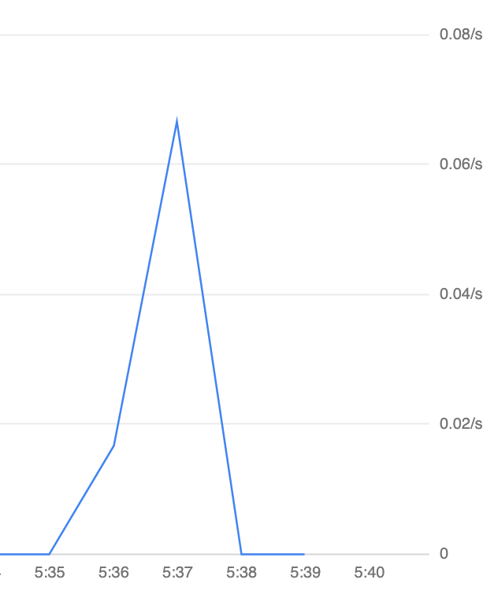
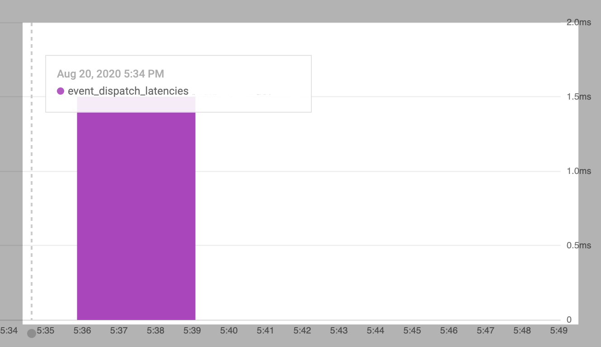

# Metrics Example

## Overview

This sample shows how to configure and view `metrics`. This includes setting up metrics, generating them by sending an
event to the broker and attaching a trigger to it and viewing those metrics with common filters in stackdriver.

## Prerequisites

1. [Install Knative-GCP](../../install/install-knative-gcp.md)

2. [Create a Service Account for the Data Plane](../../install/dataplane-service-account.md)

## Setup

1. Follow the instructions here to [Access Event Traces in Cloud Trace](../../how-to/cloud-trace.md).

2. In cloud console, navigate to Monitoring -> Metrics explorer. Enable the montoring metrics API andd add your project
to a workspace (or create a new workspace).

## Generating metrics

1. Create a namespace

   ```shell
   kubectl apply -f namespace.yaml
   ```

2. Deploy a broker and event publisher

   ```shell
   kubectl apply -f broker.yaml
   kubectl apply -f event-publisher.yaml
   ```

3. Verify that the broker is ready

    ```shell
    kubectl -n cloud-run-events-example get broker test-broker
    ```

   ```shell
   NAME          READY   REASON   URL                                                                                                         AGE
   test-broker   True             http://default-brokercell-ingress.cloud-run-events.svc.cluster.local/cloud-run-events-example/test-broker   9s
   ```

4. Deploy a trigger and event consumer

   ```shell
   kubectl apply -f trigger.yaml
   kubectl apply -f event-consumer.yaml
   ```

5. Verify that the trigger is ready

    ```shell
    kubectl -n cloud-run-events-example get trigger hello-display
    ```

    ```shell
    NAME              READY   REASON   BROKER        SUBSCRIBER_URI                                                       AGE
    hello-display     True             test-broker   http://hello-display.cloud-run-events-example.svc.cluster.local/     4s
    ```

6. ##### Send events to broker:
    SSH into the event publisher Pod by running the following command:

    ```shell
    kubectl -n cloud-run-events-example attach curl -it
    ```

    A prompt similar to the one below will appear:

    ```sh
    Defaulting container name to curl.
    Use 'kubectl describe pod/ -n cloud-run-events-example' to see all of the containers in this pod.
    If you don't see a command prompt, try pressing enter.
    [ root@curl:/ ]$
    ```

   Send multiple events like this to generate metrics:

    ```sh
    curl -v "http://default-brokercell-ingress.cloud-run-events.svc.cluster.local/cloud-run-events-example/test-broker" \
      -X POST \
      -H "Ce-Id: say-hello" \
      -H "Ce-Specversion: 1.0" \
      -H "Ce-Type: greeting" \
      -H "Ce-Source: not-sendoff" \
      -H "Content-Type: application/json" \
      -d '{"msg":"Hello Cloud Run Events!"}'
    ```

## Viewing metrics
In the [metrics explorer](https://console.cloud.google.com/monitoring/metrics-explorer) in Stackdriver, build the query
to see metrics. There are multiple options to view the results of queries - Line, Stacked Bar, Stacked Area, Heatmap.

#### Sample queries:

-   Resource type: `Cloud run for Anthos Broker`  
    Metric: `Broker event count`  
    Filter: `project_id="<your_project_id">`  
    Aggregator: `sum`

    A line graph for the above query with 5 events sent to the broker will look like this over a few minutes:

    

-   Resource type: `Cloud run for Anthos Trigger`  
    Metric: `Event Dispatch Latencies`  
    Filter: `project_id="<your_project_id>"`  
    Aggregator: `50th percentile`

    A stacked bar graph for the above query with 5 events received by the trigger will look this over a few minutes:

    

## Cleaning up
```shell
kubectl delete -f event-publisher.yaml
kubectl delete -f event-consumer.yaml
kubectl delete -f trigger.yaml
kubectl delete -f broker.yaml
kubectl delete -f namespace.yaml
```
