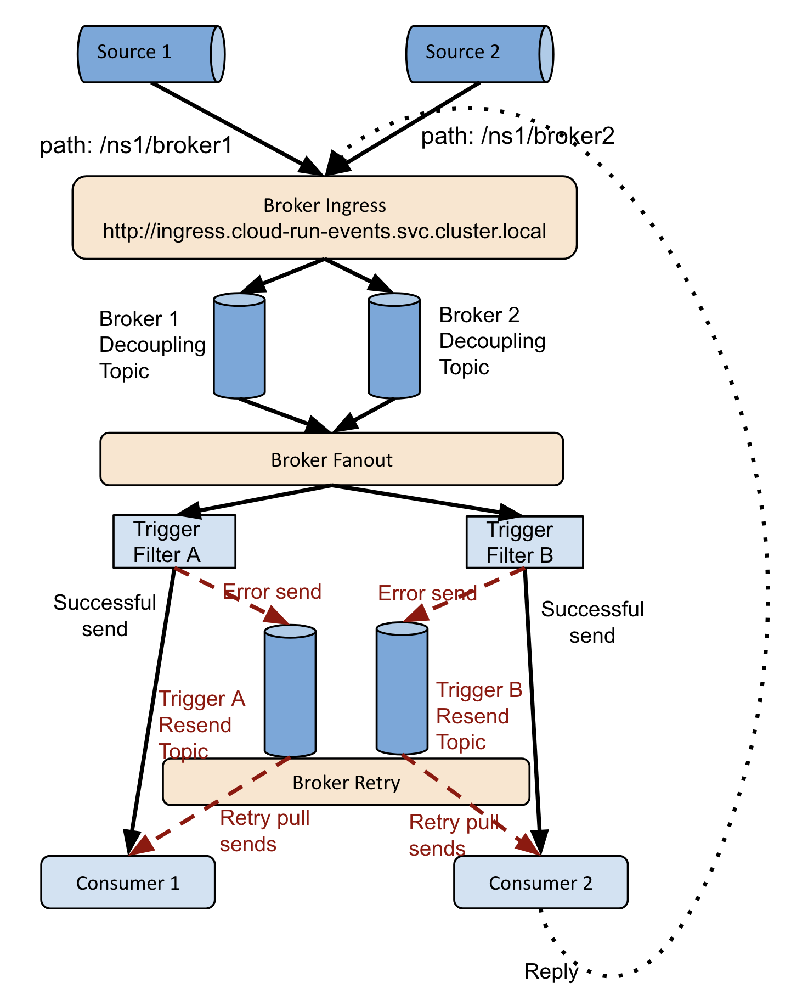

# Installing GCP Broker

**Currently the GCP Broker only supports GKE or GCE environments. Other
environments may work but are not supported.**

The GCP Broker is a Broker implementation that's highly optimized for running in
GCP using [Cloud Pub/Sub](https://cloud.google.com/pubsub).

Knative Eventing allows different Broker implementations via `BrokerClass`
annotation. If annotated with
`"eventing.knative.dev/broker.class": "googlecloud"`, the `Knative-GCP`
controller will create a GCP Broker. Compared to the default
`MT Channel Based Broker`, GCP Broker is more performant and cost-effective by
reducing hops and Pub/Sub message consumption.

## Prerequisites

1. [Install Knative-GCP](./install-knative-gcp.md).

2. [Create a Service Account for the Data Plane](./dataplane-service-account.md#create-a-google-cloud-service-account-to-interact-with-pubsub).

## Authentication Setup for GCP Broker

### Option 1: Use Workload Identity

It is the recommended way to access Google Cloud services from within GKE due to
its improved security properties and manageability. For more information about
Workload Identity see
[here](https://cloud.google.com/kubernetes-engine/docs/how-to/workload-identity).

1.  Set your project ID.

    ```shell
    export PROJECT_ID=<your-project-id>
    ```

1.  Make sure Workload Identity is enabled when you
    [Install Knative-GCP](install-knative-gcp.md). If not,
    [configure authentication mechanism](authentication-mechanisms-gcp.md) using
    the Workload Identity option.

1.  Bind the `broker` Kubernetes Service Account with Google Cloud Service
    Account, this will add `role/iam.workloadIdentityUser` to the Google Cloud
    Service Account. The scope of this role is only for this specific Google
    Cloud Service Account. It is equivalent to this command:

    ```shell
    gcloud iam service-accounts add-iam-policy-binding \
     --role roles/iam.workloadIdentityUser \
     --member serviceAccount:$PROJECT_ID.svc.id.goog[cloud-run-events/broker] \
     cre-dataplane@$PROJECT_ID.iam.gserviceaccount.com
    ```

1.  Annotate the `broker` Kubernetes Service Account with
    `iam.gke.io/gcp-service-account=cre-dataplane@PROJECT_ID.iam.gserviceaccount.com`

    ```shell
    kubectl --namespace cloud-run-events  annotate serviceaccount broker iam.gke.io/gcp-service-account=cre-dataplane@${PROJECT_ID}.iam.gserviceaccount.com
    ```

### Option 2. Export Service Account Keys And Store Them as Kubernetes Secrets

1. Download a new JSON private key for that Service Account. **Be sure not to
   check this key into source control!**

   ```shell
   gcloud iam service-accounts keys create cre-dataplane.json \
   --iam-account=cre-dataplane@$PROJECT_ID.iam.gserviceaccount.com
   ```

1. Create a secret on the Kubernetes cluster with the downloaded key.

   ```shell
   kubectl --namespace cloud-run-events create secret generic google-broker-key --from-file=key.json=cre-dataplane.json
   ```

   `google-broker-key` and `key.json` are default values expected by our
   resources.

## Deployment

- For up to [v0.15.0](https://github.com/google/knative-gcp/tree/v0.15.0), apply
  GCP broker yamls:

  ```shell
  ko apply -f ./config/broker/
  ```

- In the latest version, relevant components
  [will be created by BrokerCell on demand](https://github.com/google/knative-gcp/pull/1170),
  so, no broker-specific configs are needed at this point.

## Usage

```shell
export NAMESPACE=cloud-run-events-example
export BROKER=test-broker
kubectl create namespace ${NAMESPACE}
```

1. Create a New GCP Broker

   ```shell
   kubectl apply -f - << END
   apiVersion: eventing.knative.dev/v1beta1
   kind: Broker
   metadata:
     name: ${BROKER}
     namespace: ${NAMESPACE}
     annotations:
       "eventing.knative.dev/broker.class": "googlecloud"
   END
   ```

   Make sure you apply the annotation
   `"eventing.knative.dev/broker.class": "googlecloud"`. That triggers the
   knative-gcp to create a new GCP broker.

1. Verify that the new broker is running,

   ```shell
   kubectl -n ${NAMESPACE} get broker ${BROKER}
   ```

   This shows the broker you just created like so:

   ```shell
   NAME          READY   REASON   URL                                                                                                         AGE
   test-broker   True             http://default-brokercell-ingress.cloud-run-events.svc.cluster.local/cloud-run-events-example/test-broker   15s
   ```

Once the GCP broker is ready, you can use it by sending events to its `URL` and
create Triggers to receive events from it, just like any Knative Eventing
Brokers in [Broker and Trigger](https://knative.dev/docs/eventing/broker/).

You can find demos of the GCP broker in the
[examples](../examples/gcpbroker/README.md).

## Debugging



### Control Plane

The GCP Broker controller is responsible for provisioning the decoupling topics
and pull subscriptions for GCP Brokers, and the retry topics and pull
subscriptions for the Triggers.

- Code: The logic in in
  [broker.go](https://github.com/google/knative-gcp/blob/master/pkg/reconciler/broker/broker.go).
  The main function is the
  [shared main function](https://github.com/google/knative-gcp/blob/master/cmd/controller/main.go)
  with other controllers.
- [Deployment](https://github.com/google/knative-gcp/blob/master/config/500-controller.yaml):
  By default it's deployed as `controller` in the `cloud-run-events` namespace.

### Data Plane

All GCP Brokers share the following data plane components:

- Ingress. Ingress accepts events over HTTP/HTTPS and persists events in a
  Pub/Sub topic specific to each Broker.
  - Code:
    [main.go](https://github.com/google/knative-gcp/blob/master/cmd/broker/ingress/main.go)
  - Deployment: It contains a Service and Deployment, both called
    `broker-ingress` in the `cloud-run-events` namespace.
- Fanout. Fanout continously pull events from decouple topics for all Brokers,
  applies Trigger filters, and sends events to consumers. For failed deliveries,
  it sends the events to the corresponding retry topic.
  - Code:
    [main.go](https://github.com/google/knative-gcp/blob/master/cmd/broker/fanout/main.go)
  - Deployment: It a deployment called `broker-fanout` in the `cloud-run-events`
    namespace.
- Retry. Retry continously resends events that have failed in delivery to the
  consumers.
  - Code:
    [main.go](https://github.com/google/knative-gcp/blob/master/cmd/broker/retry/main.go)
  - Deployment: It a deployment called `broker-retry` in the `cloud-run-events`
    namespace.

### Common Issues

1. Broker is not READY
   - Check the controller logs to see if there are any errors.
   - Check if the decoupling topic and pull subscription are created. They are
     named as `cre-bkr_<namespace>_<broker>_<UID>`.
   - Check if the ingress service is ready.
   - Try sending an event anyway. Sometimes Broker is working but its status is
     not updated quickly, see issue
     [#912](https://github.com/google/knative-gcp/issues/912).
1. Trigger is not READY
   - Check the controller logs to see if there are any errors.
   - Check if the retry topic and pull subscription are created. They are named
     as `cre-tgr_<namespace>_<trigger>_<UID>`.
1. Ingress returns non 2xx status code.
   - Check the ingress pod logs.
   - Make sure the HTTP method is POST and the request is a CloudEvent. It's
     recommended to use CloudEvents SDK to make the request.
   - Compare `/var/run/cloud-run-events/broker/targets` file in the ingress pod
     with the contents in `config-targets` configmap in `cloud-run-events`
     namespace. If they are not the same, it's likely that the configmap volume
     in the pod is not updated with the latest information. Delete the pod and
     wait for it to be recreated. Meanwhile file a bug.
1. Events not delivered to consumers.
   - Check the fanout pod logs.
   - Check if the decouple pull subscription exists. Also make sure its topic is
     not `_deleted_topic_`. If so, it's likely that someone manually deleted the
     decoupling topic, see
     [#832](https://github.com/google/knative-gcp/issues/832). In this case you
     need to delete the pull subscription manually and wait for it to be
     recreated by the controller.
   - Compare `/var/run/cloud-run-events/broker/targets` file in the fanout pod
     with the contents in `config-targets` configmap in `cloud-run-events`
     namespace. If they are not the same, it's likely that the configmap volume
     in the pod is not updated with the latest information. Delete the pod and
     wait for it to be recreated. Meanwhile file a bug.
1. Events are not retried after delivery failures.
   - Check the fanout pod logs to see if it sends failed events to the retry
     topic.
   - Check the retry pod logs to see if there are any errors.
   - Check if the retry topic and pull subscription exists. Also make sure its
     topic is not `_deleted_topic_`. If so, it's likely that someone manually
     deleted the decoupling topic, see
     [#832](https://github.com/google/knative-gcp/issues/832). In this case you
     need to delete the pull subscription manually and wait for it to be
     recreated by the controller.
   - Compare `/var/run/cloud-run-events/broker/targets` file in the retry pod
     with the contents in `config-targets` configmap in `cloud-run-events`
     namespace. If they are not the same, it's likely that the configmap volume
     in the pod is not updated with the latest information. Delete the pod and
     wait for it to be recreated. Meanwhile file a bug.
1. Cannot delete a Trigger.
   - If the Broker doesn't exist, then it's a known issue:
     [#828](https://github.com/google/knative-gcp/issues/828)
   - If not, check the controller logs and file a bug if necessary.
